# EPS Scheduler Spring Boot Service

This repository contains EPS Scheduler application migrated from old application.

---

## How to run application locally

### Required JVM args

```
-Dcom.labcorp.app.env=local
```

### Required Environment variables

```
database.username=[DB_CONNECTION_STRING];
database.password=[USERNAME];
database.connection.string=[PASSWORD];
quartz.database.username=[USERNAME]
quartz.database.password=[PASSWORD]
spring.profiles.active=local
```

### Eclipse

To import the project, go to `File` > `Import`.

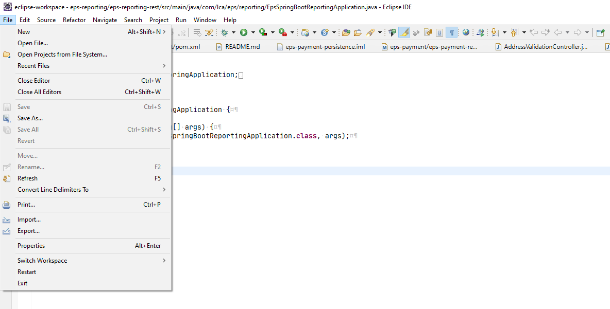

Search for `Maven` and chose `Existing Maven Project`.

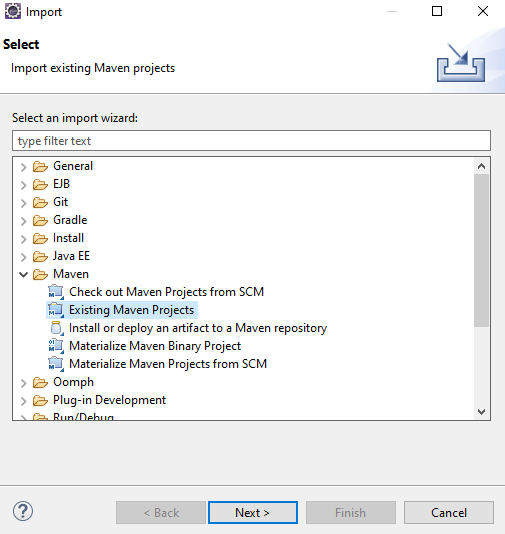

Select directory of the project in `Root Directory` selector, select parent pom and click `Finish`
button.

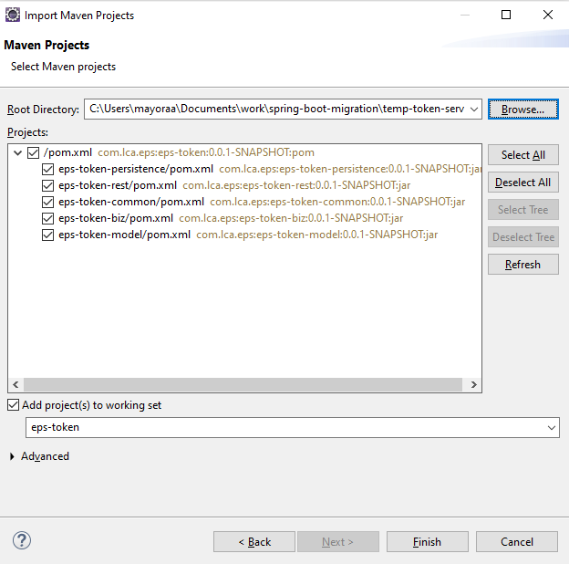

To set up the running configuration, click on small down arrow next to the green circular button with white triangle and
chose `Run configurations...`.

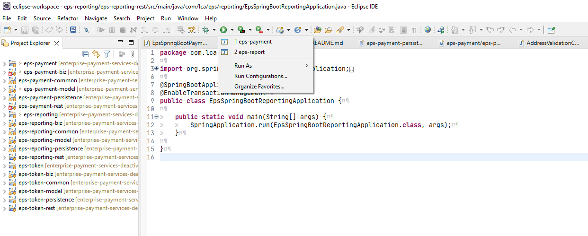

In this window make sure that `Main class` is pointing to the main class of your spring boot
application.

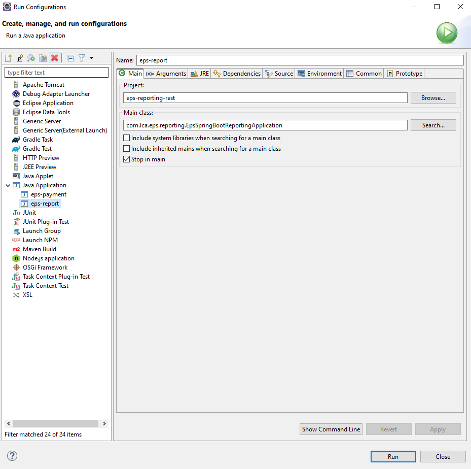

To finish the setup process, you need to add environment variables and VM options for this application.

To add VM options,
open `Arguments` tab and put all **Required JVM args** from the top of this document to the `VM arguments` field.
(Make sure that all lines started with `-D`);

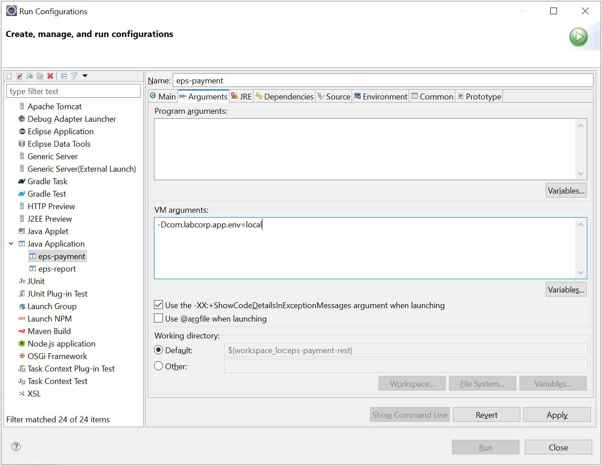

To add environment variables, open `Environment` tab and put all **Required Environment variables** from the top of this document.

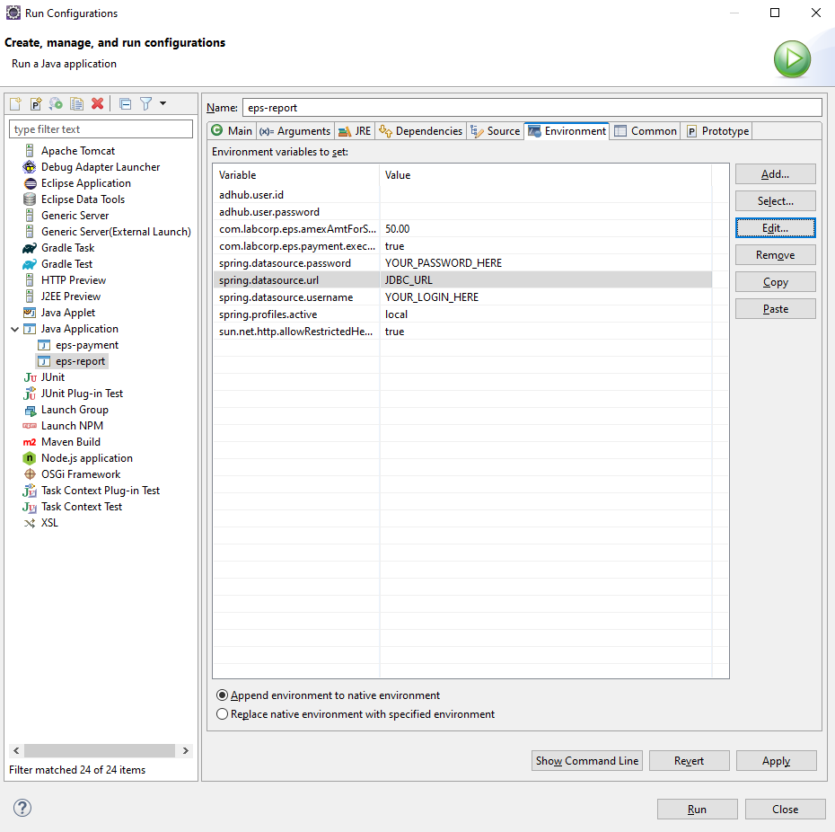

### IntelliJ IDEA

To open the project, go to `File` > `Open`.

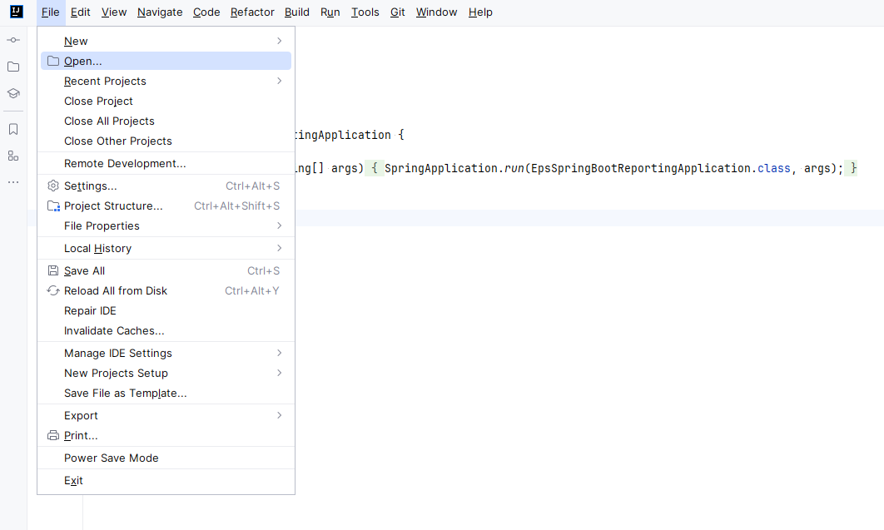

Select directory of the project and click `OK`.

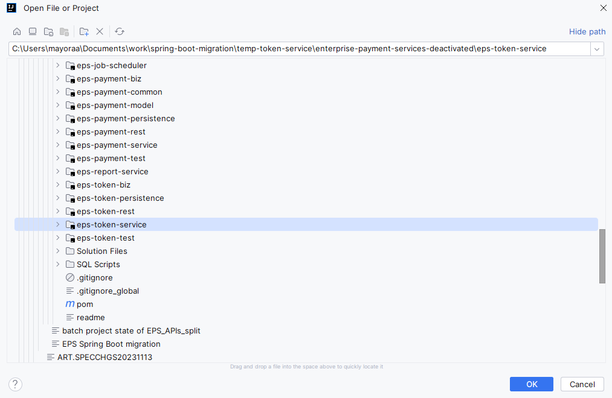

To set up the running configuration,
click on small down arrow next to the selected button in the right-top corner of the IDE and
chose `Edit configurations...`.

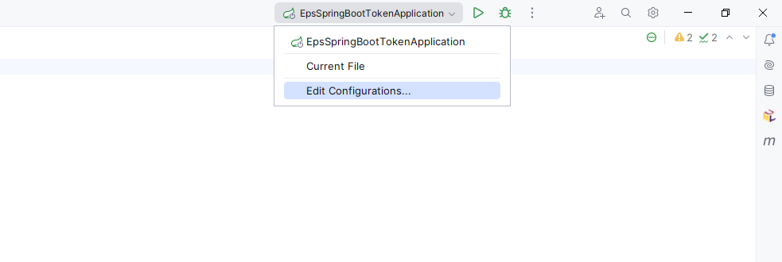

Make sure that the main class of spring boot application is chosen correctly.

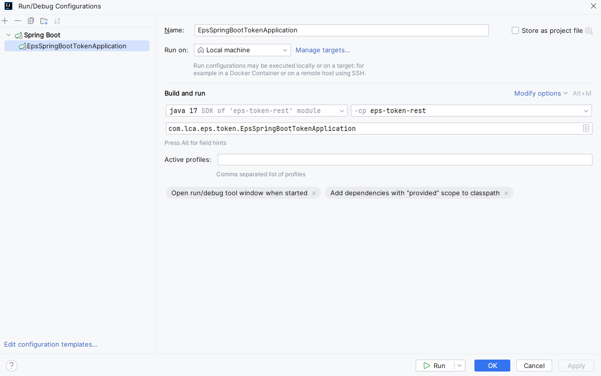

To finish the setup process, you need to add environment variables and VM options for this application.

To add VM options, click on `Modify options` button and select `Add VM options`;

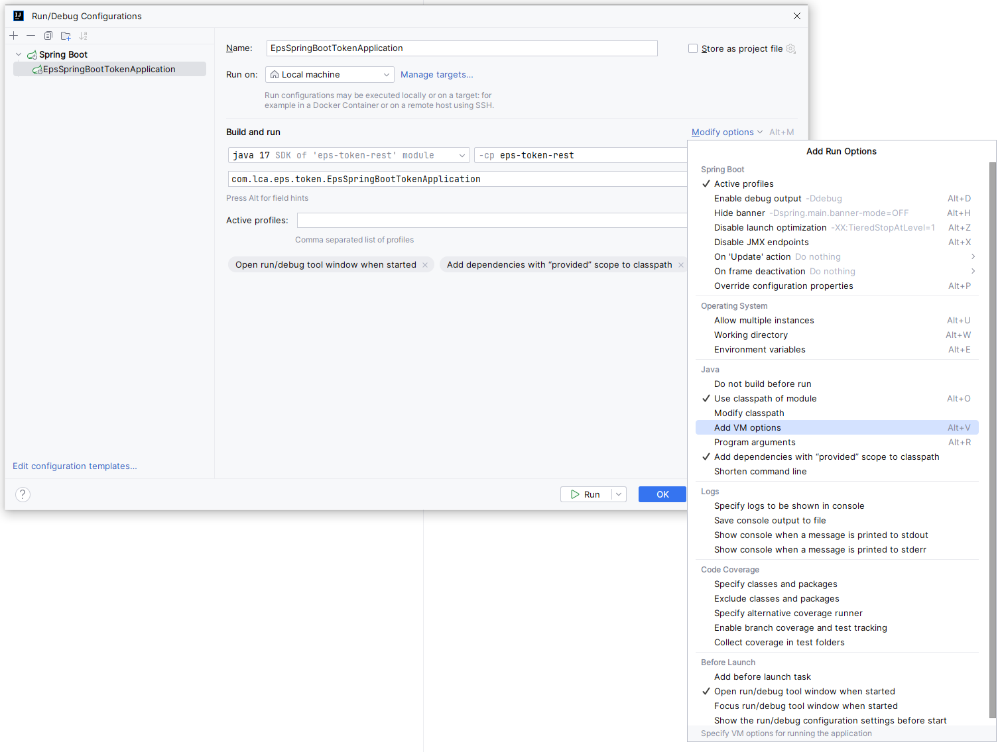

Put all **Required JVM args** from the top of this document to the new field that should have appeared.
(Make sure that all lines started with `-D`).

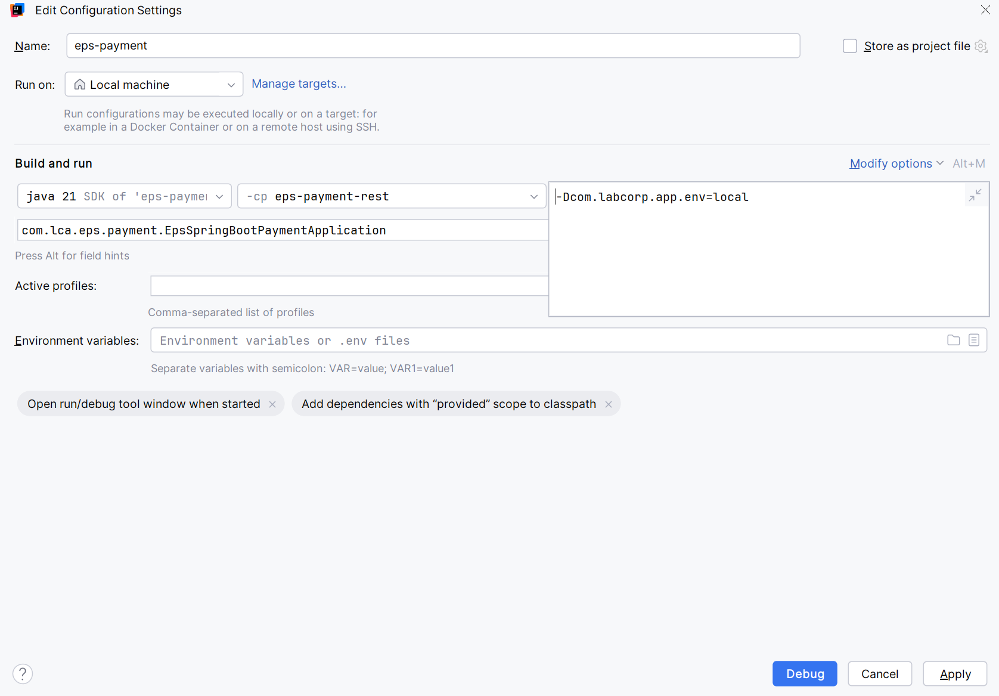

To add environment variables, click on `Modify options` button and select `Environment variables`;

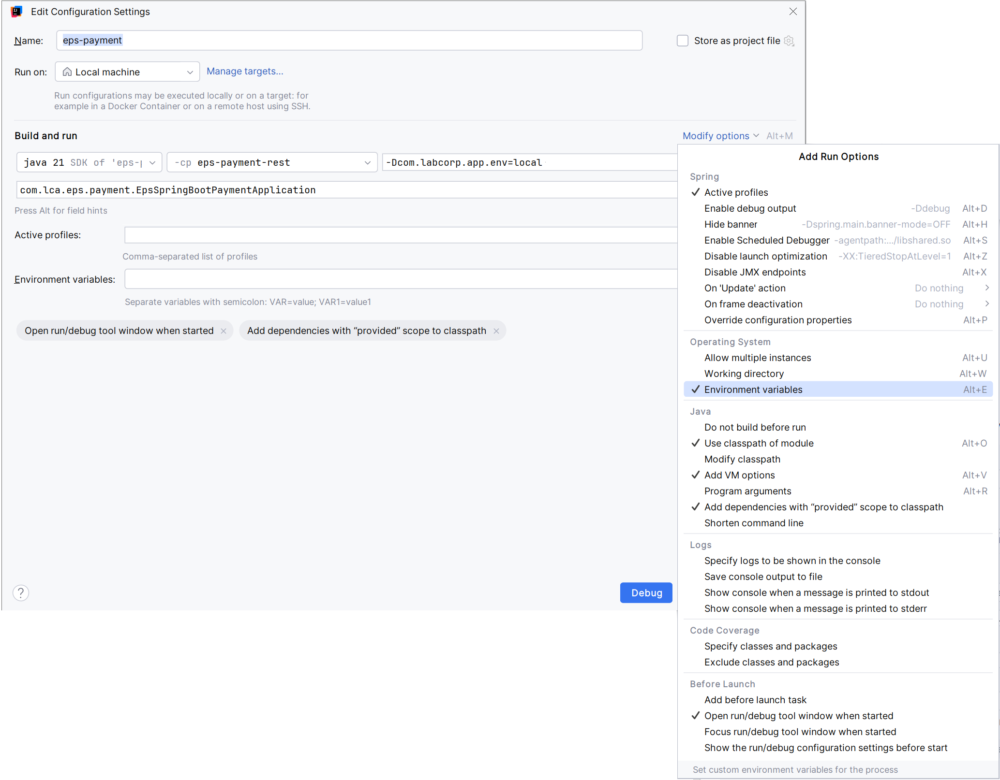

Put all **Required Environment variables** from the top of this document to the new field that should have appeared.
(Paste a string of values separated by semicolon)

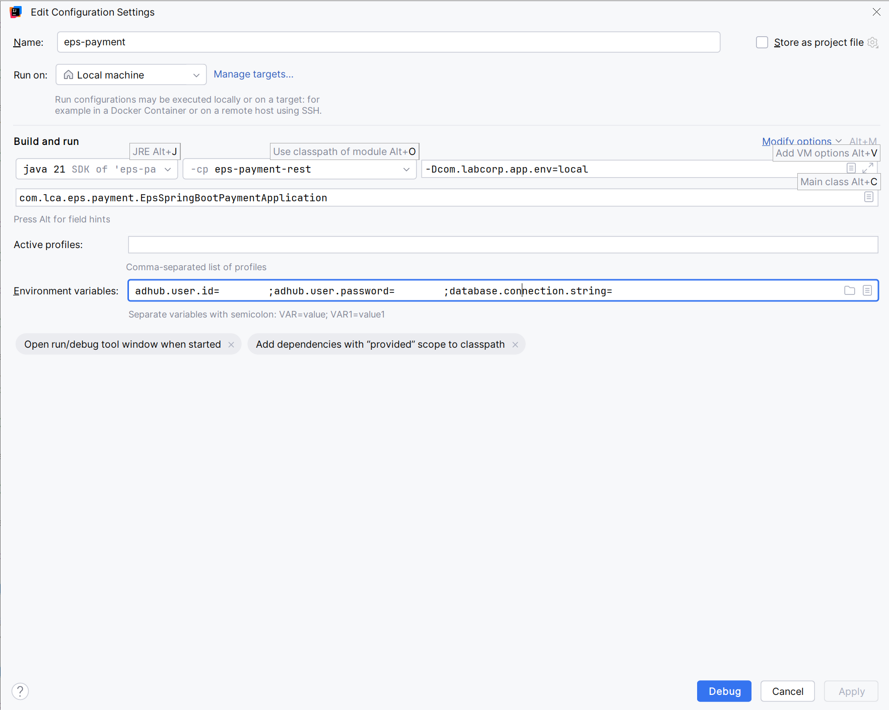
# quartz_scheduler
